# BERT: Pre-training of Deep Bidirectional Transformers for Language Understanding

## 1 引言

语言模型的预训练能够提升许多NLP任务
- NLP任务包括两类
  - 句子层面任务
    - 自然语言推理与解释：通过整体分析预测句子之间的关系
  - token层面的任务
    - NER、QA：模型要在token层面生成细粒度的输出

将预训练表示运用到下游任务的两类方法
- 基于特征（ELMo）
    - 使用特定于任务的结构，包括预训练表示作为额外特征输入到模型中
- 微调（GPT）
    - 引入最小的特定于任务的参数，通过微调所有预训练的参数在下游任务上进行训练
    
> 对**微调**和**基于特征**的理解
>> 基于特征的方法是将输入文本处理成特征向量，作为下游任务的输入，在训练过程中只调整下游任务的模型参数
> 
>> 微调的方法是在已经训练好的模型结构上，在当前任务的数据训练，对部分网络层的参数进行调整，使模型更适合当前任务
> 
>> 微调会调整预训练模型的参数，基于特征的方法不会调整预训练模型的参数

两个方法在预训练时都使用相同的目标函数
- 在预训练过程中使用单向的语言模型来学习普遍的语言表示

现有的技术限制了预训练表示的潜力，特别是微调的方法
- 标准的语言模型是单向的，限制了预训练模型结构的选择
- 对于QA等依赖于左右上下文的token层面的任务，这种限制是有害的

BERT使用掩码语言模型MLM（完形填空）的预训练目标，缓解单向限制
- MLM使表示能够融合左右上下文，这使我们能够预训练深层双向Transformers

BERT使用下一句预测来联合训练文本对表示

## 2 相关工作

### 2.1 基于特征的无监督方法

预训练的词嵌入是现代NLP系统的组成部分
- 从左到右的语言建模目标
- 在左右上下文中区分正确单词和错误单词目标

句子嵌入和段落嵌入
- 对候选下一句进行排序目标
- 根据上一句的表示从左到右生成下一句的单词目标
- 自动编码器去噪目标

### 2.2 微调的无监督方法
从未标注文本中预训练词嵌入参数

句子或文档编码器
- 产生上下文token表示
- 在未标注文本中预训练
- 在监督的下游任务进行微调

### 2.3 基于标注数据的迁移学习

CV领域证明了从大预训练模型迁移学习的重要性
- 对使用ImageNet预训练的模型进行微调

## 3 BERT
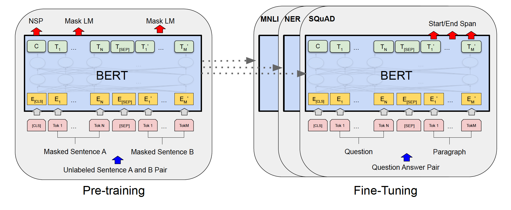

- 在**预训练**期间，模型在不同的预训练任务中基于未标注的数据进行训练。
- 对于**微调**，首先使用预训练的参数初始化BERT模型，然后使用来自下游任务的标注数据微调所有参数。
  - 每个下游任务都有单独的微调模型，即使它们是用相同的预训练参数初始化的。

BERT对不同的任务都有统一的体系结构
- 预训练模型的结构和最终下游任务结构之间的差异很小

**模型结构**

多层双向Transformers编码器
- 定义层数（Transformers块）为$L$，隐藏层大小为$H$，自注意力头为$A$
    - **$\mathrm{BERT_{BASE}}$**: $L=12,H=768,A=12$，总参数1.1亿
    - **$\mathrm{BERT_{LARGE}}$**: $L=24,H=1024,A=16$，总参数3.4亿
      - 为了便于比较，$\mathrm{BERT_{LARGE}}$与$\mathrm{GPT}$模型大小相同

**输入和输出表示**

输入表示能够在一个token序列中表示一个句子或一对句子
- 句子是一个连续文本的任意span，而不是语言学上的句子
- 序列是指输入到BERT的token序列，可以是一个句子或两个句子组合在一起

使用3000个token词典的WordPiece嵌入

序列的第一个token是一个特殊分类token$\mathrm{[CLS]}$
- 与该token对应的最终隐藏状态用于分类任务的总体序列表示

句子对被组合成一个序列，使用两种区分句子
1. 使用特殊token$\mathrm{[SEP]}$
2. 对每个token添加学习到的嵌入表示，说明其属于句子A还是句子B

定义输入嵌入为$E$，$\mathrm{[CLS]}$的最终隐藏向量为$C \in \R^H$，第$i$个输入token的最终隐藏向量为$T_i \in \R^H$

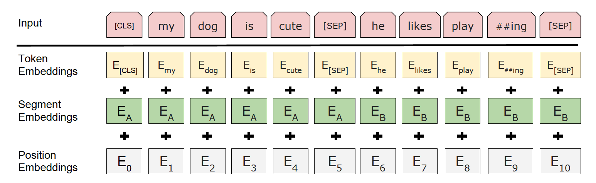

### 3.1 预训练BERT
使用两种无监督任务来预训练BERT

**任务1：掩码语言模型**

在每个序列上随机盖住15%的输入token，然后预测这些掩码token
与掩码token对应的最终向量传入字典输出softmax层中
从而获得双向预训练模型

在微调过程中没有$\mathrm{[MASK]}$ token
预训练和微调不匹配

训练数据生成器随机选择15%的token用于预测
- 80%使用$\mathrm{[MASK]}$替代原始token
- 10%使用随机token替换原始token
- 10%不替换原始token

$T_i$用于预测具有交叉熵损失的原始token

与标准的语言模型训练相比，掩码语言模型在每个batch上仅预测15%的tokens
- 为了使模型收敛，需要更多的预训练过程
  - 掩码语言模型比从左至右的模型（预测所有token）收敛更慢
  - MLM模式的绝对准确度逐渐开始优于LTR模式。

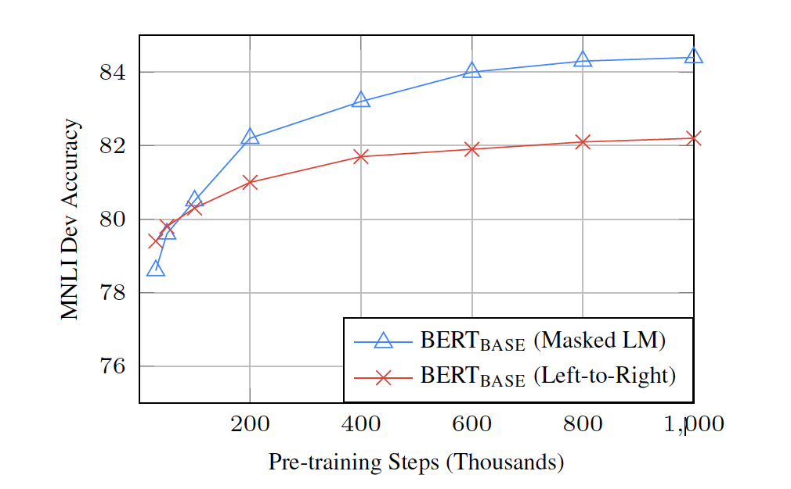

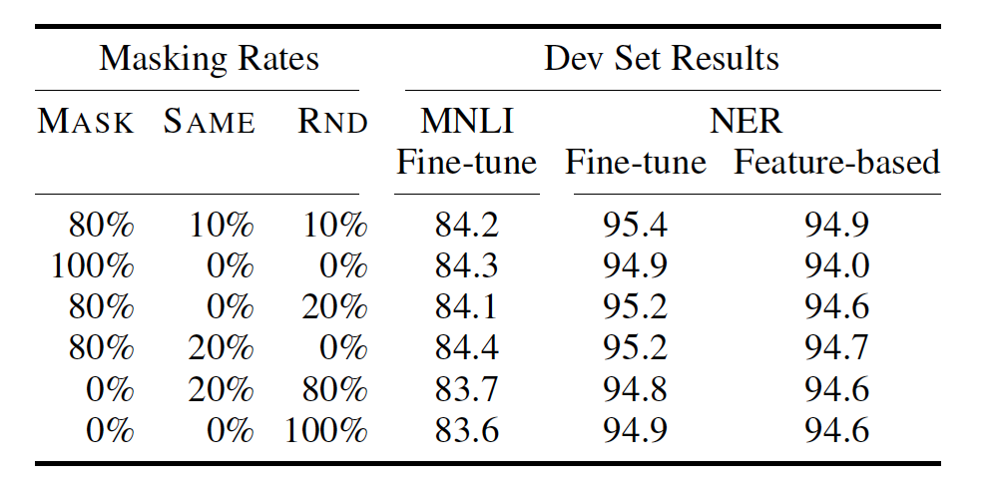

**任务2：下一句预测**

为了训练能够理解句子关系的模型，在一个二值化的下一句预测任务上预训练
- 这个任务能够从任何单语语料库生成
  - 50%的情况下句子B是句子A的下一句（IsNext）
  - 50%的情况下句子B是语料库中的随机句（NotNext）

- 图1中的向量$C$被用于下一句预测

**预训练数据**

文档级语料库
- BooksCorpus（8亿单词）
- 英文维基百科（25亿单词）
  - 只提取文本段落，忽略列表、表格、标题

**预训练程序**
- 较长的序列成本过高，为了加快预训练速度
  - 对90%的迭代进行了序列长度为128的预训练
  - 其余10%的迭代训练长度为512的序列，来学习位置嵌入

### 3.2 微调BERT

Transformers中的自注意力机制允许BERT对许多下游任务建模

    通过交换适当的输入和输出

对于每个任务，只需将特定于任务的输入和输出传入BERT中，并端到端地微调所有参数
- 预训练的句子A和句子B类似于输入的
    1. 释义中的句子对
    2. 蕴涵中的假设-前提对
    3. 问答中的问题-途径对
    4. 文本分类或句子标注中退化的文本-$\emptyset$对
- 在输出端，token表示被传入token层级的输出层
  - 例如序列标注、问答
- $\mathrm{[CLS]}$表示被传入分类器的输出层
  - 例如蕴涵、情感分析

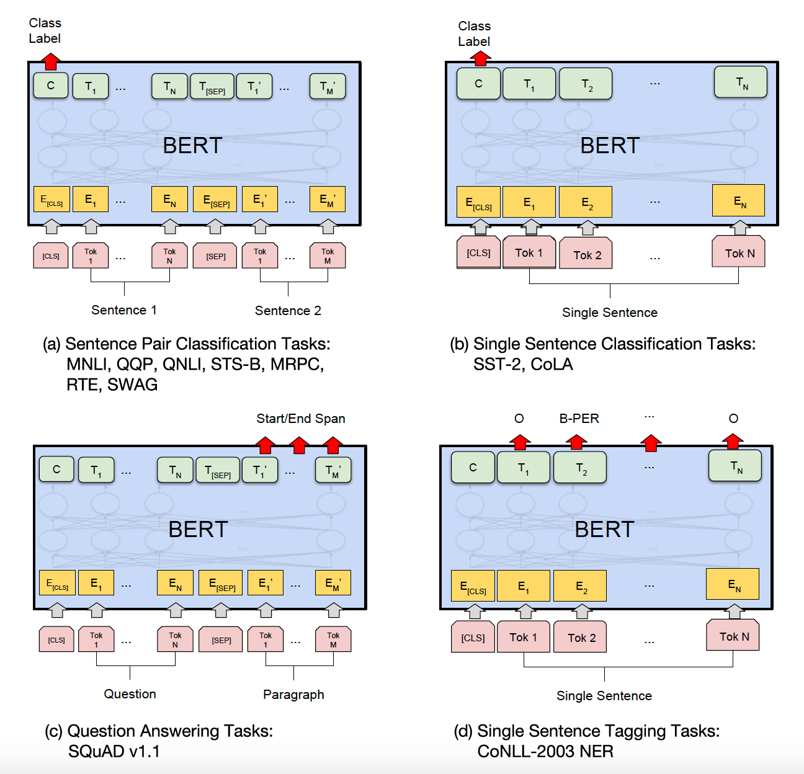

- 特定于任务的模型由BERT和额外的输出层组合而成
  - 最少数量的参数需要从头开始学习
- (a)和(b)是句子层级的任务
- (c)和(d)是token层级的任务

## 4 实验

### 4.1 GLUE

通用语言理解评估benchmark是各种自然语言理解任务的集合。

- $\mathrm{[CLS]}$的最终隐藏向量为$C \in \R^H$作为总体表示

- 为了在GLUE上进行微调过程中引入的新参数是分类器权重$W \in \R^{K \times H}$
  - $K$是标签的数量

- 使用$C$和$W$计算标准分类损失
  - 例如，$\mathrm{log(softmax(CW^T))}$

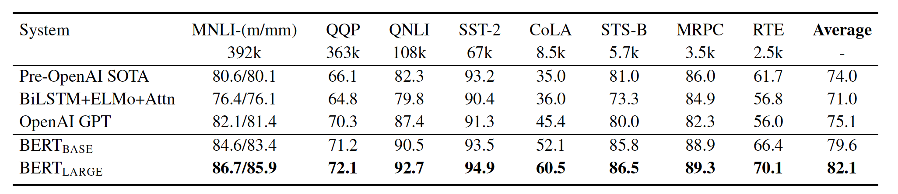

### 4.2 SQuAD v1.1

斯坦福问答数据集由10万对问题/答案组成

给定问题和来自包含答案的维基百科文章，任务的目标是预测文章中答案文本的span

- 将输入的问题和文章表示为单一序列
  - 问题用A嵌入，文章用B嵌入
- 在微调过程中，开头向量$S \in \R^H$，结尾向量$E \in \R^H$
  - 计算单词$i$是答案span开头的概率
    - $T_i$与$S$点乘的softmax
    - $P_i=\frac{e^{S\cdot T_i}}{\sum_je^{S\cdot T_j}}$
  - 答案span结尾的概率同上
- 从位置$i$到位置$j$候选span得分定义为
  - $S\cdot T_i+E \cdot T_j$
- $j\geq i$ 条件下得分最高的span作为候选
- 训练的目标函数是正确的开头位置和结束位置的对数概率之和
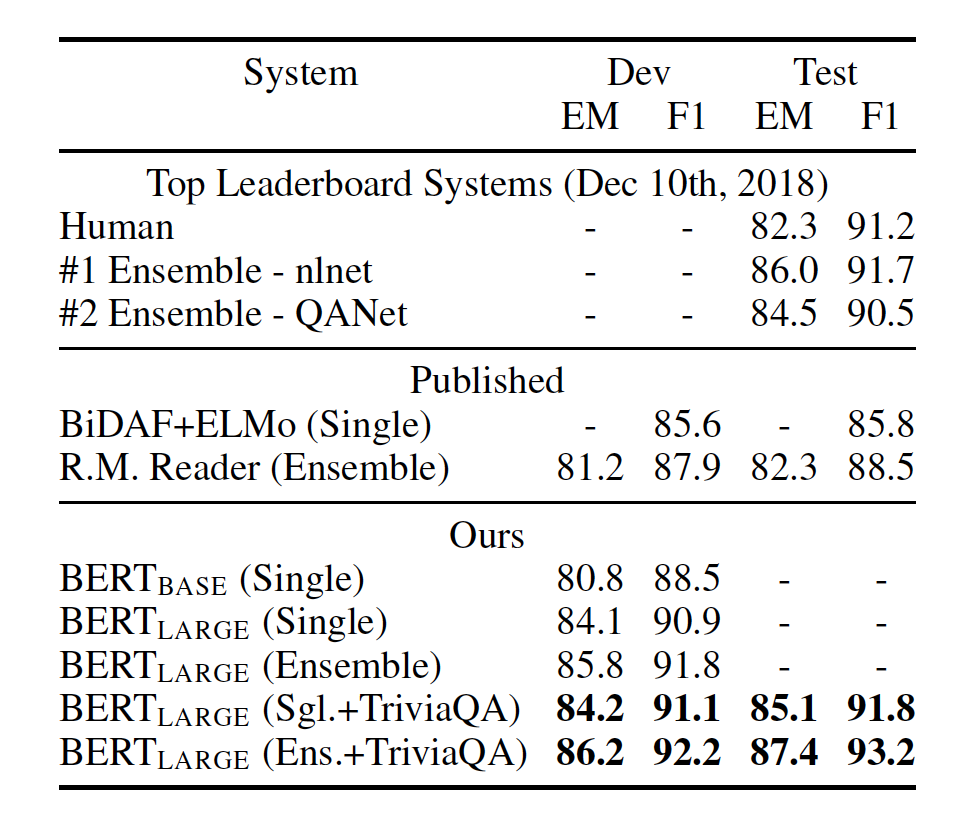

### 4.3 SQuAD v2.0

SQuAD v2.0允许在提供的段落中不存在简短答案，从而使问题更现实。

对于没有答案的问题，认为其答案span的开头和结尾是$\mathrm{[CLS]}$ token

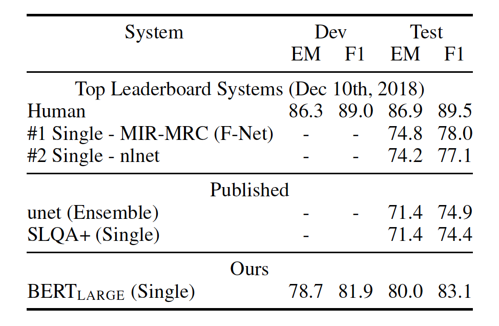

### 4.4 SWAG
对抗生成情景数据集包括11.3万个句子对，用于评估基于常识的推理
- 给定一个句子，在四个选项中选择最合理的下一句
- 在对SWAG数据集进行微调时，构造四个输入序列
  - 每个序列包括给定句子（句子A）和可能的下一句（句子B）的拼接
- 引入特定于任务的参数是一个向量
  - 该向量与$\mathrm{[CLS]}$ 的token表示$C$点积
  - 将点积结果传入softmax层归一化得到每个选择的分数
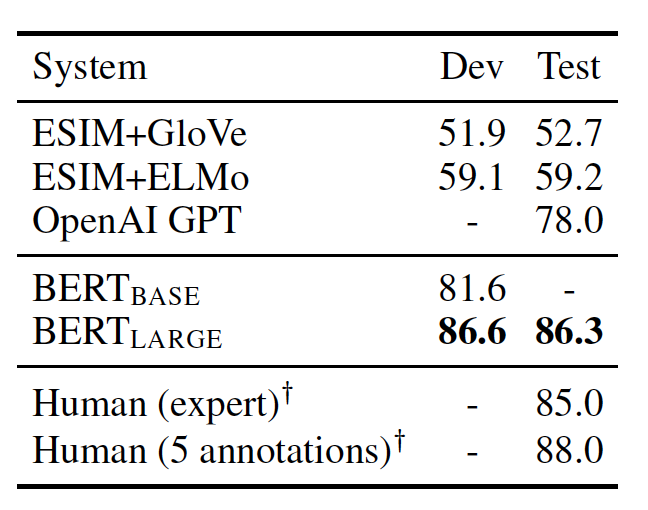

## 5 消融实验

### 5.1 预训练任务的影响

使用与$\mathrm{BERT_{BASE}}$完全相同的预训练数据、微调策略和超参数，来评估两个预训练目标，证明BERT深度双向的重要性

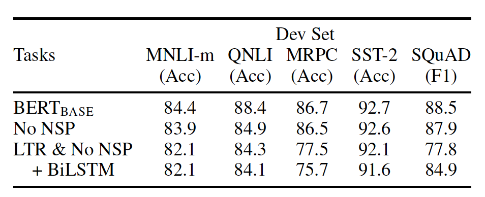

### 5.2 模型尺寸的影响

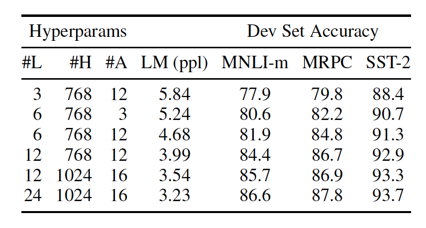

### 5.3 基于特征的BERT方法
- 微调：在预训练模型中添加一个简单的分类层，并在下游任务中联合微调所有参数
- 基于特征：从预训练模型中提取固定特征，有一定的优越性
  1. 不是所有任务能够用Transformers的编码器结构表示
     - 需要添加特定于任务的模型架构 
  2. 预先计算一次昂贵的训练数据表示，在这种表示的基础上使用便宜的模型进行许多实验，这在计算上有很大好处

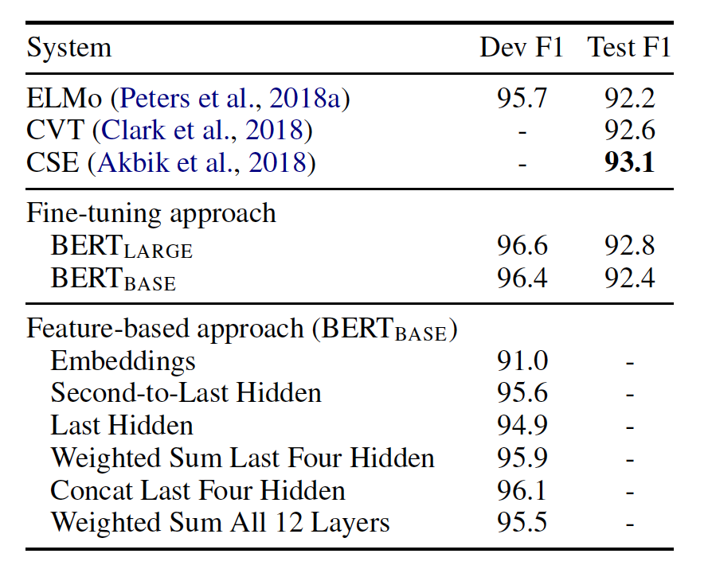

## 6 结论
由于语言模型的迁移学习，丰富的、无监督的预训练是许多语言理解系统的一个组成部分。特别是，这些结果使得即使是低资源任务也能从深层单向体系结构中受益。
我们的主要贡献是将这些发现进一步推广到深层双向结构中，使相同的预训练模型能够处理广泛的NLP任务。

$\hat{B}_{ij}=\delta_{ij}+\frac{1}{\bigtriangleup}w_i^{\dagger}w_j+c\delta_{i2}\delta_{j2}+O(\sqrt {r/a})$

$H^0=2[(p_1^2-m_1^2)+(p_2^2-m_2^2)]_{p_0=\mu}=P_0^2-2(E_1^2+E_2^2)+$