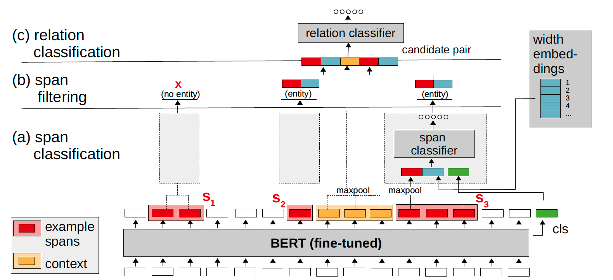
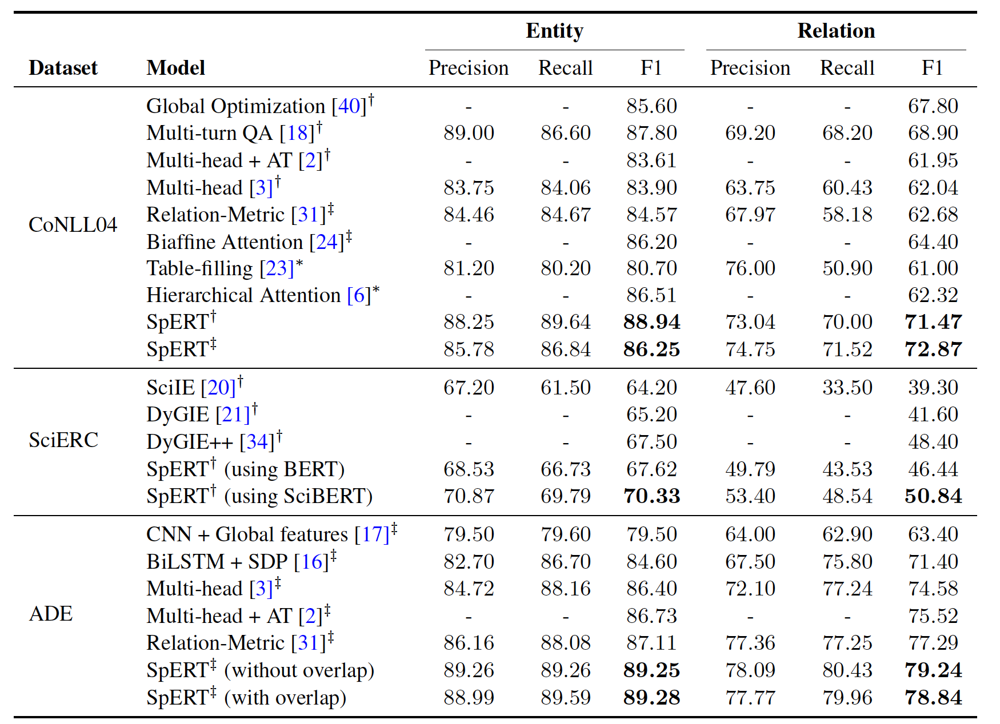
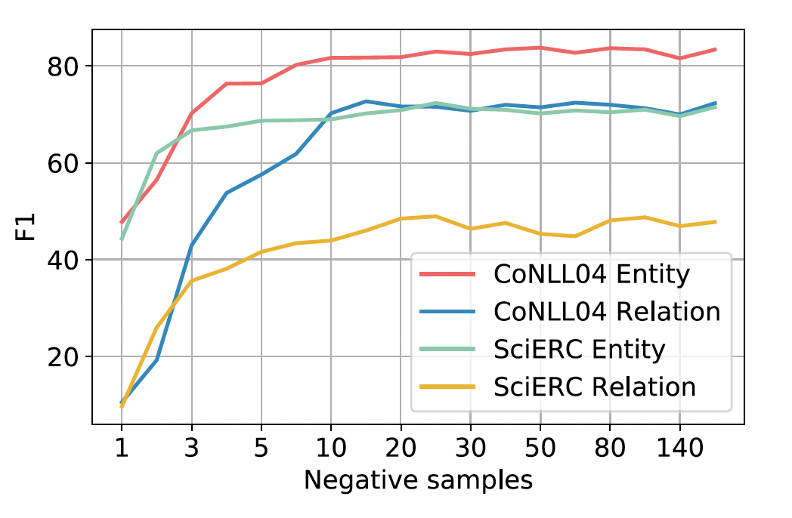
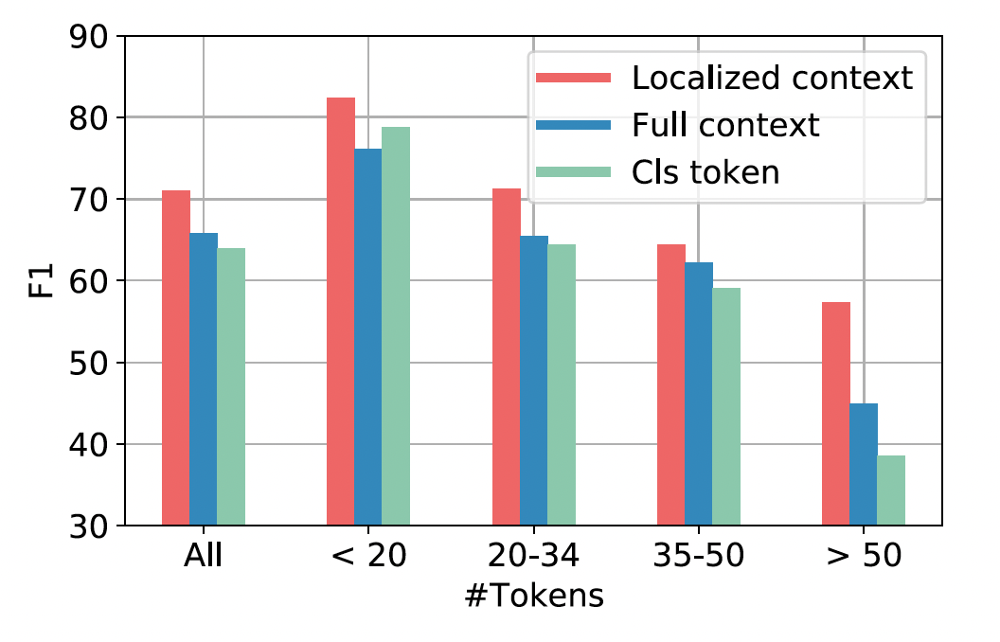
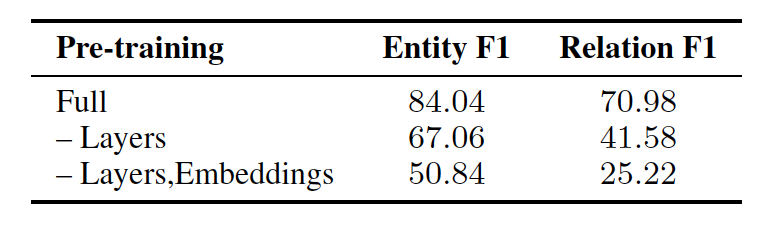
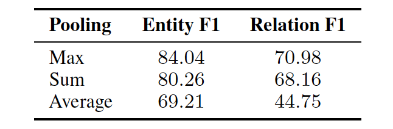

# Span-Based Joint Entity and Relation Extraction with Transformer Pre-Training
## 引言
本文研究了Transformer网络在关系抽取任务中的应用，该任务包含两个子任务：实体识别和关系分类。

我们提出了一个以Transformer网络BERT为核心的联合实体和关系抽取模型，一个基于span的方法：

- 任意token子序列（span）都是一个潜在的实体，任何一对span之间都可以存在关系
    - 我们的模型对所有这些假设进行了全面搜索
	- 不同于基于BIO/BILOU的方法，基于span的方法可以识别嵌套实体
- 我们的方法只对每个输入句子进行一个正向传播，并对结果embedding进行轻量级推理
- 我们使用局部上下文表示，而不使用特定的标记，并在一次BERT传递中从同一个句子中抽取负样本

这些方面有助于在所有span内进行有效训练和全面搜索。

贡献
- 我们的方法简单有效，关系抽取F1提升2.6%
- 模型成功原因
	1. 来自同一句子的否定样本产生了省力又高效的训练，足够数量的强否定样本似乎至关重要
	2. 局部上下文表示是有益的，尤其是对于较长的句子
	3. 与从头开始的训练相比，对预训练模型进行微调可以显著提高性能
## 相关工作
**实体关系联合抽取**

**基于span的方法**
- 对所有span进行穷举搜索
## 方法

一个输入句子被token化，获得一个n字节对编码（BPE）token的序列
	
- BPE通过公共子词（tree & house）表示==非常用词==（treehouse）
- BPE在BERT中被用来限制词典大小，能够映射词典之外的词

BPE tokens传入BERT，获得长度为$n+1$的embedding序列$（e_1, e_2, ... ,e_n, c)$
	
	最后一个token c 代表获得整个句子上下文信息的特殊分类器token

在所有span中检测实体, 将所有span分类为实体类(a)，过滤非实体(b)，最后将所有实体对分类为关系(c)

**(a) span分类**
- span分类器将任意候选span作为输入
	- 分类器将span映射为一个实体类（如person、organization、none）
	- 输入包含三部分
		1. span的BERT embeddings（红色）使用融合函数进行组合
  			> 融合函数中，max-pooling效果最好
		2. 给定span宽度$k+1$，在专用的embedding矩阵中查找宽度 embedding $w_{k+1}$（蓝色）
			- 该矩阵中包含任意宽度的固定尺寸embedding
			-  这些embedding通过反向传播学习，允许模型在span的宽度上包含先验知识
          		> 太长的span不太可能是实体
		3. 加入分类器token $c$（绿色）
	- span分类器的最终输入
    	- 首先将BERT embedding和宽度embedding拼接，得到span表示
		- 然后将span表示与分类器token $c$ 拼接
		- span分类器是一个softmax函数
		$$ \hat{y^s}=softmax(W^s\cdot x^s+b^s)$$

**(b) span过滤**
- 通过span分类器获得每个span的类别，过滤掉属于none的span，剩下的保留到集合$S$
  - 没有对实体/关系假设进行beam搜索
  - 预先过滤超过10个token的span，降低分类成本

**(c) 关系分类**
- 关系分类器处理从$S \times S$中提取的每个候选实体对$(s_1,s_2)$，并估计关系集合$R$中是否存在关系类，分类器的输入包含两个部分
	1. 为了表示两个候选实体 $s_1,s_2$，融合BERT embedding和宽度embedding
	2. 上下文的词（如配偶、总统等）是表示关系的重要标志
      	- 一种可行的上下文表示是使用分类器token $c$
        	> c不适合用于表达多种关系的长句子
		- 使用来自实体周围的更局部的上下文
    		- 第一个实体的末尾到第二个实体的开端的span（黄色）
    		- 使用max-pooling融合span的BERT embedding，获得上下文表示 $c(s_1, s_2)$
				> 若span为空，$c(s_1, s_2)=0$（两个实体嵌套）
- 通过拼接上述特征得到关系分类器的输入
	- 由于关系通常是不对称的，需要同时对 $(s_1, s_2)$ 和 $(s_2, s_1)$ 进行分类
$$ \Chi_1^r := e(s_1) \circ c(s_1,s_2) \circ e(s_2)\\
\Chi_2^r := e(s_2) \circ c(s_1,s_2) \circ e(s_1) $$
	- $\Chi_1^r$ 和 $\Chi_2^r$ 都要进入激活函数为sigmoid的单层MLP分类器
$$ \hat{y}_1^r := \sigma (W^r  \cdot x^r_{1/2}+b^r) $$

### 训练
- 在训练中学习宽度embedding、span分类器参数、关系分类器参数，微调BERT
- 训练是有监督的
  - 定义实体分类和关系分类的联合损失函数为$\mathcal{L}=\mathcal{L^s}+\mathcal{L^r}$
  - $\mathcal{L^s}$表示span分类器的损失（实体类上的交叉熵，包括none）
  - $\mathcal{L^r}$表示关系类上的二进制交叉熵
  - 这两种损失均为每个batch上样本的平均值
- 没有应用类权重
- 一个训练batch由B个句子组成，我们从中抽取两个分类器的样本
  - 对于span分类器：将所有标注实体Sgt作为正样本，再加上固定数量的随机非实体span作为负样本；
  - 对于关系分类器：提取出正确的关系作为正样本，并从未标记任何关系的实体对Sgt×Sgt中提取负样本。
- 与随机span对抽样相比，强负样本至关重要
- 我们没有生成分散在多个句子中的样本，而是对每个句子只输入一次BERT
	- 多个正/负样本分别通过实体分类器和关系分类器的单个浅线性层，大大加快了训练过程

## 实验
我们将SpERT与其他实体关系联合抽取模型进行了比较，并研究了几个超参数的影响。
评估是在三个公开的数据集上进行的
- CoNLL04
	- 包含从新闻文章中提取的带有注释的命名实体和关系的句子
	- 它包括四个实体（Location, Organization, People, Other）和五种关系类型（Work-For, Kill, Organization-Based-In, Live-In, Located-In）
	- 我们使用了Gupta等人[10]拆分的训练集（1153句）和测试集（288句）
	- 对于超参数调整，20%的训练集被用作延迟开发部分

- SciERC
    - 来自人工智能论文的500篇摘要
    - 该数据集包括六个科学实体（Task, Method, Metric, Materal, Other-Scitific-Term, Generic）和七种关系类型（Compare, Conjunction, Evaluate-For, Used-For, Feature-Of, Part-Of, Hyponym-Of），共2687句
    - 我们使用训练（1861句）、验证（275句）和测试（551句）
- ADE
  	- 由4272个句子和6821个关系组成，这些关系来自描述药物使用引起的不良反应的医疗报告。
	- 它包含单一关系型不良反应和两种实体类型不良反应和药物。
	- 我们进行了10折交叉验证。

使用$BERT_{BASE}$作为句子编码器，对于SciERC使用$SciBERT(cased)$作为句子编码器

使用正态分布随机数初始化分类器权重

宽度embedding的维度为25维

### 与SOTA模型相比

### 候选选项与负采样

### 局部上下文

### 预训练与实体表示

