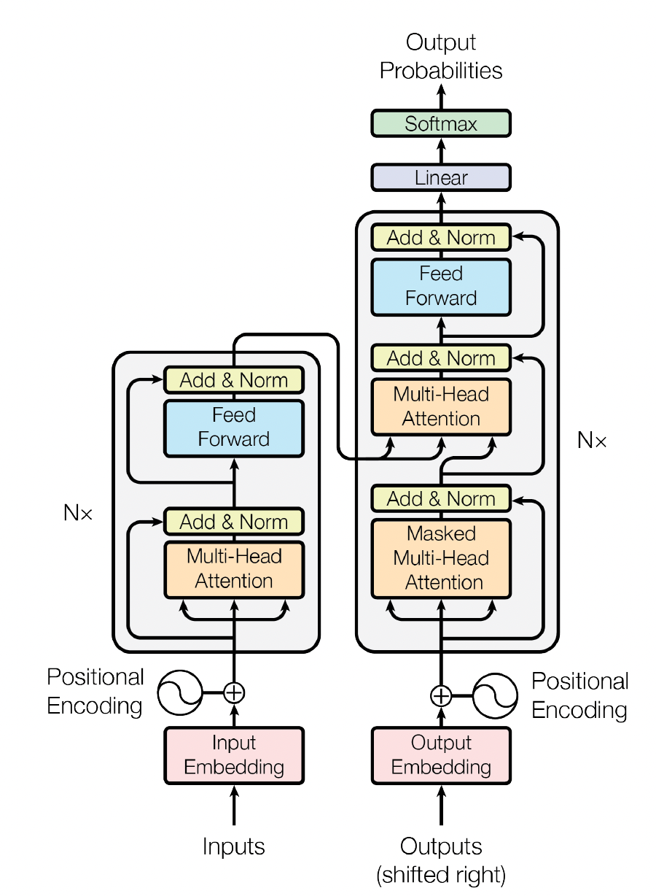
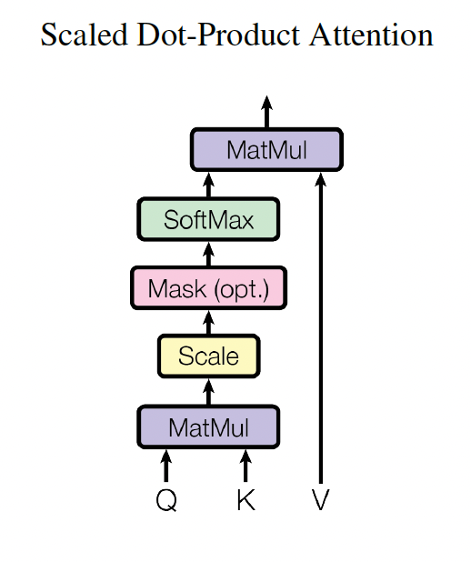
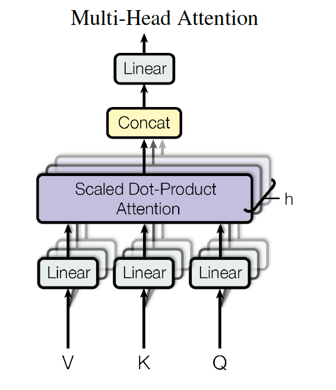
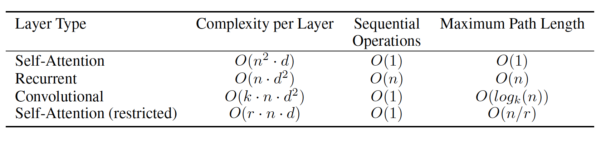
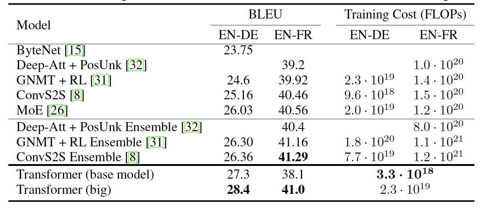

# Attention Is All You Need

## 1 引言
序列建模和转导问题（如语言模型和机器翻译）的SOTA
- RNN、LSTM、GRU

注意力机制已经成为许多任务中序列建模和转导模型的重要组成部分
- 能够在不考虑在输入和输出序列中的距离对依赖关系建模
- 但这种注意力机制常常与循环网络结合使用
    
Transformers是一种完全依赖注意力机制描述输入和输出之间的全局依赖关系的模型架构。
Transformers可以实现更大的并行化，在8个P100 GPU上训练12小时后在翻译质量方面取得了SOTA水平。

## 2 背景
**扩展神经GPU**、**ByteNet**和**ConvS2S**等模型使用卷积神经网络作为基本构造块
- 对于所有输入和输出位置，并行计算隐藏表示。
- 随着输入和输出位置距离的增加，将任意两个位置信号关联所需的操作数增加。

Transformers减少操作数为一个常量
- 平均**注意力加权**位置降低了有效分辨率
  - 注意力机制每一次可以看到所有像素（所有序列）
- 使用多头注意力抵消该影响
  - 模拟卷积神经网络的多个输出通道

自注意力机制将单个序列的不同位置联系起来，计算序列表示。
自注意力机制在**阅读理解**、**概括总结**、**文本蕴涵**、**学习任务无关的句子表示**等任务成功使用。

## 3 模型结构
大多数比较好的神经网络**序列转导模型**都使用了编码器-解码器架构。
- ==编码器==将符号表示的输入序列$(x_1,...,x_n)$映射为连续表示的序列$Z=(z_1,...,z_n)$
  - $z_t$是$x_t$的向量表示
- 给定$Z$，==解码器==一个一个地生成符号输出序列$(y_1,...,y_m)$
  - 每一步模型都是自回归的，在生成下一个时，将先前生成的符号序列作为额外输入 

Transformers遵循了编码器-解码器的整体架构，编码器和解码器都是用了堆叠的自注意力和point-wise全连接层。

### 3.1 编码器与解码器

**编码器**

编码器包括$N=6$个完全相同的层
- 每个层包括两个子层。
  - 第一个子层是多头注意力机制
  - 第二个子层是一个简单的point-wise全连接前向网络（MLP）
  - 对每个子层使用残差连接，然后进行==层归一化==
    > 每个子层的输出是$LayerNorm(x+Sublayer(x))$
    >> $Sublayer(x)$是由子层实现的功能
  - 为了便于残差连接，模型中的所有子层以及embedding层都会生成维度为512的输出

**解码器**

解码器包括$N=6$个完全相同的层
- 每个层包含三个子层
  - 第三个子层对编码器的输出执行多头注意力
  - 对每个子层使用残差连接，然后进行==层归一化==（批量归一化不适合序列长度会变的NLP应用）
    > 关于层归一化与批量归一化
    >> 批量归一化是对每个特征/通道里的元素进行归一化。
    >> 层归一化是对每个样本里面的元素进行归一化。
    >>> 假设1个batch包含五个句子，每句话有7个tokens，一个token的维度是4。
    >>> 批量归一化是对1个batch进行归一化，即对5个句子的所有token每个维度的特征进行归一化，包含35个元素；层归一化是对1个句子进行归一化，即对1个句子内7个tokens的所有特征进行归一化，包含28个元素。
  - 修改解码器中的自注意力子层来防止位置转移到后续位置
    > 这种掩码，加上输出embedding偏移一个位置，使得对位置i的预测仅依赖于位置小于i的已知输出

### 3.2 注意力机制

注意力函数可以描述为将==query==、一组==key== ==value==对映射为输出
- ==query==、==key==、==value==和输出都是向量
- 输出是==value==的加权和
  - 分配给每个==value==的权重由==query==和==key==的相似性函数计算得到

**缩放点积注意力**

输入包括维度为$d_k$的==query==和==key==以及维度为$d_v$的==value==。
- 计算query与所有key的点积，除以$\sqrt{d_k}$，传入softmax函数，获得每个value的权重。
- 输出矩阵为：
$$Attention(Q,K,V)=softmax(\frac{QK^T}{\sqrt{d_k}})V$$

  > 对公式的理解（李宏毅——自注意力机制）
  >> 假设有一个长度为4的序列，序列中每个token的维度为$n$
  >> $W^q,W^k,W^v\in \R^{m\times n},a_i\in \R^{n\times 1}$，其中，$a^i$是第$i$个token的特征向量
  >> 首先判断第1个token与序列中所有token的相似性
  >>> 计算第1个token的query：
  > $q^1=W^qa^1$，其中，$q^1\in \R^{m\times 1}$
  >>> 计算所有token的key:
  > $k^1=W^ka^1,...,k^4=W^ka^4$，其中，$k^i\in \R^{m\times 1}$
  >>>计算第1个token的query与所有token的key的相似性函数（点积）
  > $\alpha_{1,1}=q^1\cdot k^1,...\alpha_{1,4}=q^1\cdot k^4$
  > 得到的$\alpha_{1,i}\in \R^{1\times 1}$，为第1个token与第n个token的注意力得分/相似性
  > 将$\alpha_{1,i}$传入softmax层对注意力得分进行归一化，得到$\alpha_{1,i}^{'}$
  >>> 计算所有token的value:
  > $v^1=W^va^1,...,v^4=W^va^4$，其中，$v^i\in \R^{m\times 1}$
  >>> 将$v^i$与$\alpha_{1,i}^{'}$相乘，并累加得到$b^1$
  >>>
  >>> $\displaystyle b^1=\sum_iv^i\alpha_{1,i}^{'}$，其中，$b^1\in \R^{m\times 1}$
  >>>第1个token与哪个token的注意力分数越高，b1就越接近哪个token的value
  >>
  >> 随后重复上述操作，依次判断判断第2，3，4个token与序列中所有token的相似性
  >> 在实际操作中，$b_1,b_2,b_3,b_4$同时计算产生
  >>> $W^q\in \R^{m\times n},a_i\in \R^{n\times 1}$，将$a_1,a_2,a_3,a_4$拼接得到$I\in \R^{n\times 4}$
  >>> $Q=W^qI \in \R^{m\times 4}$
  > 同理，$K=W^kI \in \R^{m\times 4},V=W^vI \in \R^{m\times 4}$
  >>> $A=K\cdot Q=K^TQ\in \R^{4\times 4}$
  > $A^{'}=softmax(A)\in \R^{4\times 4}$
  >>>$\displaystyle O=VA^{'}\in \R^{m\times 4}$
- 常用的注意力函数包括加性注意力和点积注意力
  - 加性注意力使用MLP计算相似性函数
  - 点积注意力与本文使用的注意力函数类似，但没有除以$\sqrt{d_k}$
  - 两种注意力函数在计算复杂度上相似
    - 由于点积注意力使用高度优化的矩阵乘法代码实现，因此在实践中速度更快，空间效力更高。
- 在解码器中额外进行掩码操作，只计算当前位置之前的注意力函数
  - 将当前位置之后的值设置为$-\infty$，输入softmax层
  - 输出后当前位置之后的值都为0

**多头注意力**

1. 将 $d_{model}$ 维的query、key、value分别输入h个不同的线性层，映射到 $d_k,d_k,d_v$ 维
2. 对不同层的quiry、key、value并行计算注意力函数，得到 $d_v$维的输出值
3. 将这些 $d_v$维的输出值拼接，并输入到一个线性层得到最终值

多头注意力能够同时关注不同位置的不同特征表示空间的信息。

在Transformers中，$h=8,d_k=d_v=d_{model}/h=64$。
    
    将512维的query、key、value映射到64维，最后8个拼接的时候仍然是512维。

### 3.3 Position-wise前向神经网络

对输入进行两次线性变换和一次激活函数（单隐藏层MLP：512 -> 2048 -> 512）
$$FFN(x)=max(0,xW_1+b_1)W_2+b_2$$

### 3.4 Embeddings与Softmax
- 用学习到的embedding将输入token和输出token转换为$d_{model}$维度的向量
- 用学习到的线性变换和softmax函数将解码器输出转换为下一个token的预测概率
- 两个embedding层和预softmax线性变换共享权重矩阵
  - 在embedding层中，权重矩阵乘$\sqrt{d_{model}}$

### 3.5 位置编码

**位置编码**与编码器和解码器底部的**输入embedding**相加
- 位置编码的维度为$d_{model}=512$
- 使用不同频率的正余弦函数表示位置编码
  - 位置编码的每个维度对应一个正弦波
- 也可以使用学习到的位置embedding

## 4 为什么使用自注意力

其中，$n$是序列长度，$d$是向量维度，$k$是卷积核大小，$r$是受限自注意力的邻域尺寸

## 5 训练
### 5.1 训练数据和批处理

**WMT 2014 English-to-German**

- 包含450万个句子对
- 使用字节对编码（BPE）
  - 英语和德语共享包含37000个tokens的词典
  
**WMT 2014 English-to-French**
- 3600万个句子
- 将tokens分成32000单词级别的词典
- 近似长度的句子对分成一个batch
- 每一个batch包含一组25000个source tokens和25000个target tokens的句子对

### 5.2 硬件和时间

base模型使用本文描述的超参数，迭代10万次，训练12小时
large模型迭代30万次，训练3.5天

### 5.3 优化器

使用Adam优化器

### 5.4 正则化

**Residual Dropout**

**标签平滑**

## 6 结果

## 7 结论

我们提出了Transformers，第一个完全基于注意力机制的序列转导模型，用多头自注意力替代了在编码器-解码器架构中最常用的循环层。
在**WMT 2014 English-to-German**和**WMT 2014 English-to-French**翻译任务上取得了SOTA。