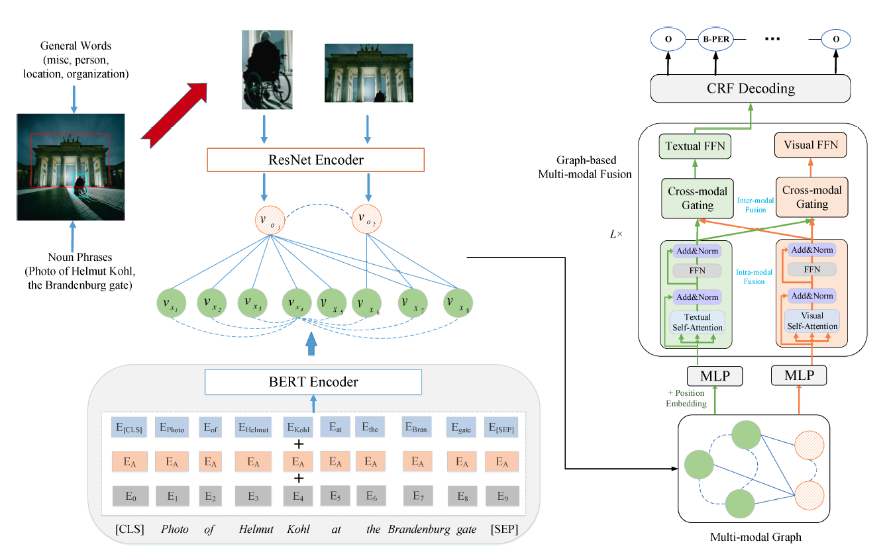

# Multi-modal Graph Fusion for Named Entity Recognition with Targeted Visual Guidance

## 1 引言
- 挑战
  1.  如何构建统一的表示来减小两种模态间的语义差异
  2.  如何基于统一的表示实现语义交互
-  面向MNER的多模态图融合方法
   -  将输入句子和图表示为统一的多模态图
      -  每个节点代表一个语义单元
         -  文本词或视觉对象
      - 边有两种类型
        - 一种建模同一模态语义单元之间的语义关系（模态内边）
        - 一种建模不同模态语义单元之间的语义关系（模态间边）
   - 堆叠多个基于图的多模态融合层
     - 迭代进行节点之间的语义交互来生成图编码
     - 在这个过程中，区分两种模态的参数，依次进行模式内融合和模式间融合，从而学习多模态节点表示
   - 使用CRF解码器利用这些表示进行实体标记

## 2 面向MNER的多模态图融合

**任务定义**
- 给定句子$X$及其对应的图片$O$作为输入
- MNER的目的是从句子$X$中抽取出一组实体并分类
- 将该任务定义为序列标注问题

### 2.1 多模态图

**节点构建**
- 在节点集$V$中，每个节点代表文本词或视觉对象
- 采用以下策略构建两种类型的节点
  1. 将所有词作为单独的文本节点
  2. 使用Stanford parser识别输入句子中的所有名词短语，使用visual grounding toolkit检测每个名词短语的边界框。引入四种预定义的实体类型促进识别更多对象。将检测到的所有视觉对象作为独立的视觉节点。

**边构建**
- 边集合$E$中包含模态内边和模态间边
  - 同一模态内的任意两个节点通过模态内边相连
  - 表示名词短语的文本节点和对应的视觉节点通过模态间边相连
  - 每个词和通过预定义的四种实体识别的视觉节点通过模态间边相连
- ReLU激活函数的MLP将两种模态的不同特征映射到相同空间
  - 对于每个文本节点$v_{x_i}$，定义其初始状态为$H^{(0)}_{x_i}$作为BERT和位置编码输出的词嵌入之和，然后接文本MLP到d维度
  - 利用ResNet的视觉特征获得视觉节点$v_{o_j}$的初始状态$H^{(0)}_{o_j}$，然后接视觉MLP到d维度
 
### 2.2 基于图的多模态融合
- 在MLP层的顶端，堆叠L个基于图的多模态融合层来编码多模态层
  - 在每个融合层，依次进行模态内融合和模态间融合来更新节点状态
  - 最后的节点状态同时编码同一模态内的上下文和模态间语义信息
  - 由于视觉节点和文本节点是包含不同模态信息的两种类型的语义单元，分别应用相似的操作但不同参数来建模状态更新过程。
- 在第l层融合层，同时更新文本节点状态$H_x^{(l)}=\{H_{x_i}^{(l)}\}$和视觉节点状态$H_o^{(l)}=\{H_{o_j}^{(l)}\}$，主要包含以下步骤：
  - 模态内融合
    - 使用自注意力生成每个节点的上下文表示
      - 所有文本节点的上下文表示
        - $$C_x^{(l)}=MultiHead(H_x^{(l-1)},H_x^{(l-1)},H_x^{(l-1)})$$
      - 所有视觉节点的上下文表示
        - $$C_o^{(l)}=MultiHead(H_o^{(l-1)},H_o^{(l-1)},H_o^{(l-1)})$$
  - 模态间融合
    - 使用element-wise操作的跨模态门控机制生成每个节点跨模态邻居的语义信息
      - 文本节点$v_{x_i}$的表示
        - $$R_{x_i}^{(l)}=C_{x_i}^{(l)}+\sum_{i \in \mathcal{N}(v_{x_i})}\alpha_{i,j} \odot C_{o_j}^{(l)}$$
        - $$\alpha_{i,j}=sigmoid(W_1^{(l)}C_{x_i}^{(l)})+ W_2^{(l)}C_{o_j}^{(l)})$$
        - $\mathcal{N}(v_{x_i})$是$v_{x_i}$的近邻视觉节点，$W_1^{(l)}$和$W_2^{(l)}$是参数矩阵
      - 视觉节点$v_{o_j}$的表示
        - $$R_{o_j}^{(l)}=C_{o_j}^{(l)}+\sum_{i \in \mathcal{N}(v_{o_j})}\beta_{j,i} \odot C_{x_i}^{(l)}$$
        - $$\beta_{j,i}=sigmoid(W_3^{(l)}C_{o_j}^{(l)})+ W_4^{(l)}C_{x_i}^{(l)})$$
        - $\mathcal{N}(v_{o_j})$是$v_{o_j}$的近邻文本节点，$W_3^{(l)}$和$W_4^{(l)}$是参数矩阵
      - 该融合方法可以根据每个模态的上下文表示更好地确定模态间融合的程度
    - 使用point-wise前馈神经网络FFN生成文本节点状态$H_i^{(l)}$和视觉节点状态$H_o^{(l)}$
      - $$H_i^{(l)}=FNN(R_{x}^{(l)})$$
      - $$H_o^{(l)}=FNN(R_{o}^{(l)})$$
      - $R_{x}^{(l)}=\{R_{x_i}^{(l)}\},R_{o}^{(l)}=\{R_{o_j}^{(l)}\}$，代表所有文本节点和图像节点更新后的表示
### 2.3 CRF解码器

- 通过多个基于图的多模态融合层，视觉信息融入所有文本节点
- CRF考虑邻域中标签之间的相关性，对标签进行联合建模
  - 在训练阶段，使用最大条件似然估计学习参数
  - 在推理阶段，预测获得最大分数的输出序列