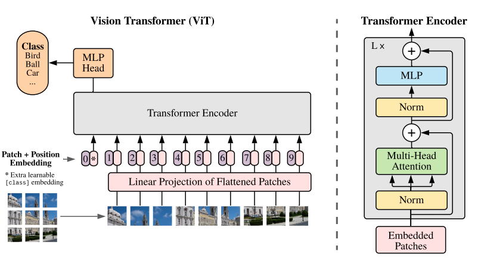
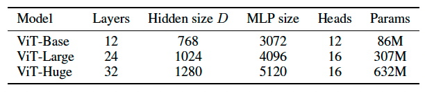
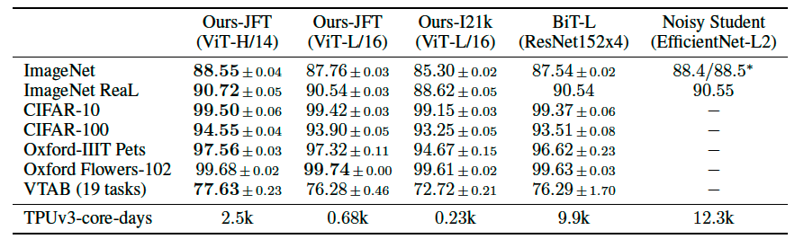
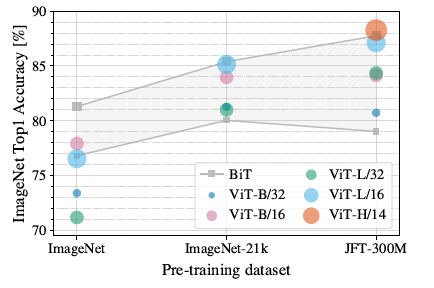

# AN IMAGE IS WORTH 16X16 WORDS: TRANSFORMERS FOR IMAGE RECOGNITION AT SCALE
## 引言
Transformers模型在NLP领域广泛应用。

Transformers架构在CV领域应用困难，卷积神经网络在CV领域占主要地位。
			
    图像分类：图片大小224×224，如果把像素拉成序列，序列长度为50176，远远大于NLP的512。计算复杂度太大。

ViT把图片打成很多patch，每个patch大小为16×16，这样可以将图片拉成14×14=196的序列长度。即一个句子等价于很多16×16的单词。

CNN包含两个归纳偏置，有了很多先验信息。

	1.假设图片上相邻的区域会有相邻的特征（例如，桌子和椅子大概率靠在一起）	
    2.平移等变性（无论是先卷积还是先平移，结果是等效的，因为卷积核相当于一个模板）

Transformers不包含这些先验信息。但是当模型在更大规模数据集上做预训练，效果好于归纳偏置。

## 结论
ViT没有引入图像特有的归纳偏置，在大规模数据集上做预训练后，在很多图像分类的benchmark上超过了之图像分类的benchmark上超过了之前的SOTA模型，且相对便宜

ViT应用在目标检测：**ViT-FRCNN**

ViT应用在语义分割：**SETR**

自监督预训练是未来发展方向。

更大的ViT：**ViT-G**

## 相关工作
**BERT**：完形填空的自监督预训练形式

**GPT**：语言模型（next word prediction）的自监督预训练形式
## 方法
尽可能按照原先的Transformers设计模型，不需要改变架构。

假设有一个224×224大小的图像，设置一个patch为16×16，则可以获得一个长度为196的序列。一个patch就是一个图像块，每个图像块的维度$D$是16×16×3=768。

将这个序列输入线性投射层（全连接层）$E$：768×768，得到patch embedding：196×768（196个token，每个token的向量维度为768）。此外，加入一个额外的class embedding：1×768，两个embedding相互拼接，所以最后加入Transformers Encoder的序列为197×768。

由于每个图像块包含位置信息，因此加入Position Embedding，每个位置是一个1D的位置编码（可以学，与BERT一致），长度为768，将位置编码信息和patch embedding相加，序列仍然为197×768。

class token可以用全局平均池化GAP替换，1D的位置编码可以用2D和相对位置编码替换，但为了尽可能与原始Transformers一致，不做过多改动。

归纳偏置

    除了把图像切成patch和位置编码，模型不包含归纳偏置，一切信息从头开始学。
混合结构

    把224×224的图像给一个CNN（ResNet），得到一个14×14的特征图，拉成196的序列给全连接层，得到patch embedding。
微调

    图片尺寸变大，如果保持patch不变，序列长度就要变长，位置编码就要更新。
## 实验

对比ResNet，ViT和混合模型。

### 数据集
			
ImageNet，ImageNet-21K，JFT

**下游任务（分类）**

	ReaL，CIFAR-10/100，Oxford-IIIT Pets，Oxford Flowers-102

### 模型变体

### 结果

### 分析

预训练数据集越大，ViT表现效果越好

### 自监督
mask patch prediction