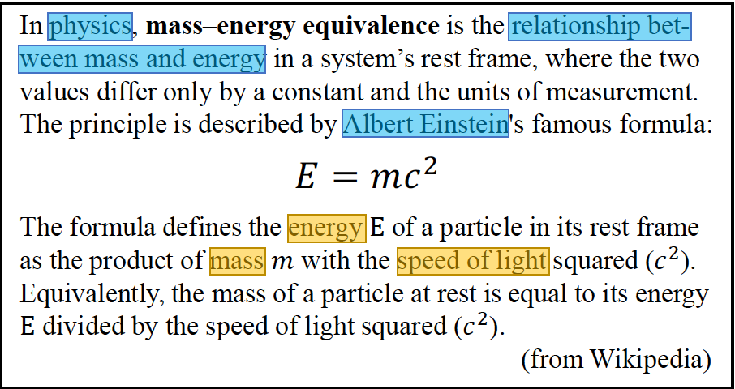
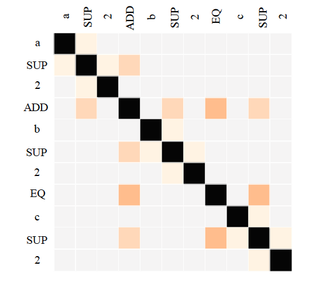
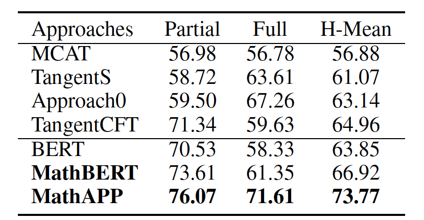
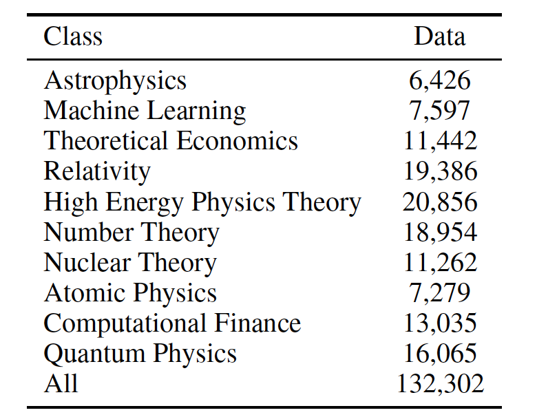

## MathBERT: A Pre-Trained Model for Mathematical Formula Understanding

### 摘要

- 现有的预训练模型忽视了公式及其上下文之间的结构特征和语义关系
- MathBERT联合训练数学公式及其相应的上下文
- 为了进一步捕捉公式的语义层次结构特征，设计了一个新的预训练任务
  - 预测从公式的语义结构表示**运算符树**（OPT）中提取的掩码公式子结构
- 在三个下游任务上进行了实验
  - 数学信息检索、公式主题分类和公式标题生成。
  - 实验结果表明，MathBERT在所有这三个任务上都显著优于现有方法
- 证明了该预训练模型有效地捕获了公式的语义层次结构信息
- MathBERT是第一个用于数学公式理解的预训练模型

### 1 引入

数学公式在科学、技术和工程领域广泛应用。
- 由于数学公式表示的多样性、公式结构的复杂性和隐含语义的模糊性，处理数学信息仍然是一项具有挑战性的任务。
- 现有的研究没有考虑对公式和上下文进行联合训练。

大规模预训练模型在NLP领域取得了巨大的成就
- ELMo、GPT、BERT、XLNet

在NLP领域的成功促进了预训练模型在特定领域的发展
- VideoBERT、CodeBERT、LayoutLM

从公式中获得的可用信息是有限的，上下文中往往包含理解公式至关重要的信息
- 每个符号的含义
  - E: energy
  - m: mass
  - c: light speed
- 重要的公式关联信息
  - 领域：物理
  - 内在含义：质量与能量的关系
  - 提出者：Albert Einstein

学习公式表示的预训练任务
- 掩码语言模型（MLM）
- 上下文对应预测（CCP）
- 掩码子结构预测（MSP）
  - 获取公式**语义层面的结构信息**

构建大规模数据集，训练MathBERT
- 包含870万条**公式-上下文**对
- 从arXiv.org上发布的论文中抽取

在三个下游任务上评估模型
- 数学信息检索、公式主题分类和公式标题生成
- 实验结果表明，MathBERT在所有三个任务上都显著优于现有方法

定性地表明，该模型能够有效地捕获公式的**语义层面的结构信息**。

### 2 相关工作
#### 2.1 预训练模型
#### 2.2 数学公式表示

与纯文本不同，数学公式有很强的结构特征

- 使用树结构表示数学公式
  - 符号布局树（SLT）
  - 运算符树（OPT）
- MathBERT选择OPT作为输入
  - SLT中公式的布局信息已在一定程度上包含在LaTeX代码中
  - OPT在合并语义层面结构信息方面起着至关重要的作用
    - OPT包含数学语法和语义，指导数学运算的复原

### 3 MathBERT
#### 3.1 模型结构

- MathBERT的骨干网络
  - 一种加强的多层双向Transformers，改良自vanilla BERT
- MathBERT的输入
  - 拼接公式LaTeX tokens，上下文和运算符ƒ
- 基于OPT结构改进Transofmers注意力机制
  - 以增强其捕获结构信息的能力

- 给定
  - LaTeX tokens序列$T=\{t_1,t_2,...,t_{L_T}\}$
  - 上下文 $C=\{c_1,c_2,...,c_{L_C}\}$，
  - 运算符树$OPT=\{N,E\}$，
    - $N=\{n_1,n_2,...n_{L_N}\}$是运算符集合
    - $E=\{e_1,e_2,...e_{L_E}\}$是边集合
- 将上面三项拼接得到输入：
  - $[CLS],t_1,t_2,...,T_{L_T},[SEP],c_1,c_2,...,c_{L_C},[SEP],n_1,n_2,...n_{L_N}$

- 构建注意力掩码矩阵
  - 对于任意两个节点，如果不存在边$e_k\in E$
    - 则在注意力掩码矩阵$M$中对应的值$M_{(i,j)}$和$M_{(j,i)}$为0，$M$中其他的值为1
    - $M_{(i,j)}= \begin {cases} 0 \qquad if \, \left \langle n_i,n_j \right \rangle \notin E\ and \left \langle n_i,n_j\right \rangle \notin E\ and \ i \neq j.\\ 1 \qquad otherwise.\end{cases}$

#### 3.2 预训练任务
MathBERT 掌握三方面的信息
- 文本表示
- 公式之间的潜在关系
- 上下文

**掩码语言建模**
- 给定输入$[CLS]\ T\ [SEP]\ C\ [SEP]\ N$
  - 随机从$T$和$C$中采样15%的tokens
    - 其中80%替换为$[MASK]$
    - 10%随机替换为任意tokens
    - 10%不变
  - 目标函数为预测被mask掉的原始tokens
- 由于公式、上下文和运算符的互补关系，鼓励使用其他分段来预测masked tokens，有助于建立三个分段的连接

**上下文对应预测**
- 数学公式和上下文之间存在潜在语义关系，无法用语言模型直接表示
- 类似于NERT中的NSP任务，训练二元CCP任务
  - 50%的上下文$C$被随机替换为数据集中的其他撒谎给那些爱问
  - 目标函数为预测当前输入的上下文$C'$是否是$T$的对应上下文

**掩码子结构预测**
- 子结构是指由运算符及其父节点和子节点组成的结构，是OPT的一部分
- 在输入$N$中随机采样15%的节点作为$N_{mask}$
  - 对于$N_{mask}$的每个节点$n_i$，切断其与父节点和子节点，从而mask掉$n_i$输入哪个子结构
- 目标函数是预测masked $n_i$的父节点和子节点

#### 3.3 预训练数据
- 几乎没有由公式上下文对组成的大型公共数据集
- 从arXiv.org的公开科学论文上构建预训练数据集
  - Amazon S3提供的Arxiv批量数据是一整套Arxiv文档
    - 其中包含源TEX文件和已处理的PDF文件
      - "\begin{equation}...\end{equation}"用作从TEX文件中LaTeX源抽取行间公式的匹配模版
      - 收集公式周围至少400个字符作为公式上下文，并将公式替换为特殊token$[MATH]$
- 使用im2markup中的工具包LaTeX tokenizer
- 使用TangentS中的OPT转换器将LaTeX代码转换为OPT
- 得到870万条公式及其上下文和对应OPT的大型数据集

#### 3.4 预训练细节
- 在4个NVIDIA TITAN X 12GB GPU上训练MathBERT，batch size为48。
- 为了更好地利用NLP中现有的预训练模型并加速训练过程，我们使用预训练的$BERT_{base}$模型初始化MathBERT的权重
  - 该模型具有一个12层的Transformers，隐藏层大小为768。
- 由于GPU内存的限制，输入序列的最大长度设置为256。
- Adam优化器的学习率为2e-5。
- 对MathBERT进行大约1千万次迭代的870万数据训练需要两周的时间。

### 4 实验

#### 4.1 数学信息检索

- 给定一个公式作为查询，返回公式与大规模语料库中公式的相关性
- 可以使用向量相似度对语料库中的公式进行索引用于检索
- MathBERT在NTCIR-12数学检索维基百科公式浏览任务上进行评估
  - 该任务是公式检索最新benchmark
  - 该数据集包含来自英文维基百科的59万个数学公式和20个non-wildcards查询
  - 两名人工评估员从高度相关到不相关对hit打分（0,1,2），从而评估参与系统的pooled hit
  - 最终hit的相关度评分是两名人工评估员的打分之和（0-4）
    - 3分及以上为完全相关
    - 1分及以上为部分相关
- 将MathBERT中最后两层特征向量的平均值视为公式embeddings，并根据公式向量上的余弦相似度对TangentCFT的前1000个结果重排序，使用bpref作为衡量标准
- 遵循TangentCFT中的方法，通过组合MathBERT和Approach0的检索分数创建另一个模型（MathAPP），实现了SOTA效果

#### 4.2 公式主题分类

- 目的为预测数学公式属于哪个主题。
- 从arXiv上10个选定的主题一年内发表的论文中收集了132302个**公式上下文对**作为TopicMath-100K数据集。

#### 4.3 公式标题生成

- 公式标题生成是一项摘要任务，旨在从包含**数学公式**和**描述**的详细数学问题中生成简明的数学标题。
- 使用EXEQ-300K作为数据集。
  - 使用MathBERT提取输入序列的表示，并通过注意机制将其与Transformer编码器和解码器的每一层融合，以生成标题。
  - 将获得的结果与四种提取方法（随机法、Tail法、Lead法和TextRank法）、四种摘要式方法和BERT-fused进行比较。

#### 4.4 消融实验

- 为了探讨不同模式和训练前任务的影响，分别对数学信息检索任务和公式主题分类任务进行了消融实验
  - 实验中采用了四种不同的训练前设置：
    1. 使用公式、上下文和OPT作为输入，并使用所有三项预训练任务
    2. 不使用OPT和MSP预训练任务
    3. 不使用上下文和CCP预训练任务
    4. 只使用公式和MLM预训练任务

#### 4.5 定量分析

- 选择15个包含相似符号的公式，其中一些公式在数学上具有相等的含义。
- 使用三种嵌入模型从这些公式中提取特征向量，并根据余弦相似度对其进行排序。
  - MathBERT很好地融合了**语义信息**
  - MathBERT还保留**布局结构信息**

### 5 结论
- 在本文中，我们提出了一个新的有效的预训练模型MathBERT，这是第一个用于**数学公式理解**的预训练模型。
- MathBERT与数学公式、上下文及其相应OPTs联合训练。
- 实验结果表明，MathBERT在数学信息检索、公式主题分类和公式标题生成三个下游任务上都取得了SOTA结果。
- 消融实验表明，我们的预训练设置有助于提升下游任务的表现。
- 定性分析进一步证明了MathBERT在获取数学表达式**语义层面结构信息**方面的有效性。

## Symlink: A New Dataset for Scientific Symbol-Description Linking

### 1 引文

- 理解科学文献的一个关键角度是理解它们的**术语**和相应的**数学公式**
  - 术语和公式能够精确呈现科学概念之间关系
  - 为了理解科学概念，阅读理解机需要
    1. 识别**科学概念描述**及其**公式**
    2. 将其分割为**原始术语**和**符号**
    3. 将相关**术语**和相应**符号**联系起来

- 两个原因导致研究数学公式十分困难
  1. 无法使用ASCII或Unicode以纯文本形式编写复杂的数学公式
  2. 大多数科学文档以图片或PDF的形式存储
- 使用LaTeX作为基本排版，以实现科学文档分析pipeline

- 从LaTeX文档中提取数学符号及其相应的文本描述
  - 数据点$N$的数量
  - 单个数据点$x_1$和$x_N$
  - 向量维度$d$
- 这些符号的描述在单个句子范围内呈现

- 之前的研究试图将**描述**与**公式层面的表达式**链接起来
  - 然而，必须在更原始的层面上理解数学表达式，例如**符号层面**
  - 我们的工作重点是这种细粒度的注释，用于数学符号和描述的抽取和链接
- 之前的研究基于模版匹配和规则，仅仅构建了少数小规模数据集，用于评估英国文学
  - 不可能在这些小数据集上训练和评估基于深度学习的高级模型
  - 本文提出了一个用于英语科技文献符号描述链接任务的大规模数据集

### 2 数据标注

- **数据来源**：从arXiv.org上获取文档
  - ArXiv提供了物理学、数学、定量生物学、计算机科学、定量金融、统计学、电气工程和经济学方面的论文
    - 因此，我们获得的论文包含了大量的数学符号和方程，从而可以更高产量地提取符号描述关系
  - 选择了数学、物理、生物学、经济学和计算机科学五门学科用于注释
- **数据准备**：arXiv开源了这些文章的LaTeX版本
  - 从.tex文件中抽取所有段落
  - 过滤少于50个单词的段落和没有符号的段落
  - 一个公式可以通过多种方式组成
    - 行内公式
    - 行间公式
    - 使用命令（array）
    - 保持公式的原始TeX格式
  - 所有这些数学对象在tokenization之前都被mask掉
  - 使用SciBERT的Tokenizer来tokenize文本，然后还原数学对象
  - 删除所有嵌套的数学对象，得到非嵌套的LaTeX数据
    - 使得LaTeX文档与PDF-to-LaTeX工具生成的文档（不包含嵌套对象）更相似
- **标注分类**：设计了一个包含3种通用实体类型和4种关系类型的分类体系
  - 实体：
    - SYMBOL：数学符号
    - PRIMARY：单个独立定义的描述
    - ORDER：多个术语的描述（在不创建非连续提及的情况下，其提及不会分开）
    - 由于**描述**和复杂**数学表达式**的大量组合
      - 当且仅当有第二个实体与第一个实体配对以形成关系时才标记实体
  - 关系：
    - 关注两种主要的关系类型
      - DIRECT：连接符号和定义
      - COUNT：连接概念描述和表示概念实例数的符号
    - 由于描述和符号的重复和互引数量巨大，也标记了以下两种关系
      - COREF-SYMBOL：连接共指符号
      - COREF-DESCRIPTION：连接共指描述
  - 标注：
    - 从众包平台upwork.com上招募了10名标注员
    - 标注了101篇论文，共5719个句子和33万个标记

### 3 数据集分析

- 数据集包含超过2.2万个实体、1万对**描述**和**符号**，比类似任务的现有数据集大一个数量级。

- 大多数实体长度为1-3个tokens
- 符号和描述的span长度在1-47个tokens之间
  - 长span的符号和描述可能会给模型带来混淆

分布可以划分为两类
  - 符号描述关系
    - 分布具有长尾性，表明符号和描述往往出现在非常接近的位置
  - 共指关系
    - 分布均匀，表明共指关系在短距离和长距离都存在

### 4 实验